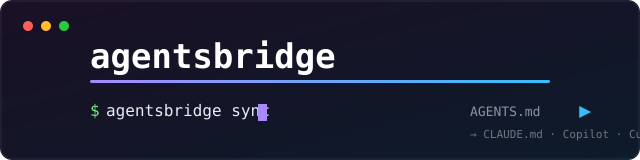

<div align="center">



**One `AGENTS.md`. Every AI coding tool. Zero drift.**

[](https://github.com/DavidStarYu/agentsbridge/actions/workflows/ci.yml)
[](https://pypi.org/project/agentsbridge/)
[](https://pypi.org/project/agentsbridge/)
[](LICENSE)
[](https://github.com/astral-sh/ruff)

[Bridge](#why) · [Quick start](#quick-start) · [Supported tools](#supported-tools) · [CI drift check](#ci-drift-check) · [FAQ](#faq)

</div>

---

## Why

Your team uses Claude Code. Your teammate uses Cursor. Someone just switched
to Codex CLI. And suddenly your coding standards live in **five different
files** that silently drift apart:

```text
AGENTS.md                          ← Codex, Gemini CLI, Jules, Amp, Zed read this
CLAUDE.md                          ← Claude Code reads this (not AGENTS.md)
.github/copilot-instructions.md    ← GitHub Copilot reads this (not AGENTS.md)
.cursor/rules/*.mdc                ← Cursor reads this (not AGENTS.md, older versions)
.windsurfrules / .clinerules       ← Windsurf / Cline read these
CONVENTIONS.md                     ← Aider reads this
```

`agentsbridge` fixes this with one command. You maintain **one** `AGENTS.md`
(the emerging industry standard) — it generates and keeps every tool's file
in sync. Edit once, sync everywhere, and let CI catch anything that drifts.

## Quick start

```bash
pipx install agentsbridge        # or: pip install agentsbridge / uv tool install agentsbridge
```

**Already have rules somewhere?** Import them:

```bash
agentsbridge import              # seeds AGENTS.md from CLAUDE.md, .cursorrules, etc.
```

**Starting fresh?**

```bash
agentsbridge init                # creates a starter AGENTS.md
```

Then — the only command you'll ever need again:

```bash
agentsbridge sync
```

```text
  + created   CLAUDE.md
  + created   .github/copilot-instructions.md
  + created   .cursor/rules/agentsbridge.mdc
  + created   .windsurfrules
  + created   .clinerules
  + created   CONVENTIONS.md

wrote 6 file(s)
```

Edit `AGENTS.md`, run `agentsbridge sync`, commit. That's the whole workflow.

## Supported tools

| Tool | File generated | Notes |
|---|---|---|
| **Claude Code** | `CLAUDE.md` | |
| **GitHub Copilot** | `.github/copilot-instructions.md` | |
| **Cursor** | `.cursor/rules/agentsbridge.mdc` | with `alwaysApply` frontmatter |
| **Windsurf** | `.windsurfrules` | |
| **Cline** | `.clinerules` | |
| **Aider** | `CONVENTIONS.md` | |
| **Codex CLI, Gemini CLI, Jules, Amp, Zed, opencode** | — | read `AGENTS.md` natively, nothing to generate |

Missing a tool? [Open an issue](https://github.com/DavidStarYu/agentsbridge/issues) —
adding a target is ~10 lines.

## Safety

Generated files are marked:

```markdown
<!-- generated by agentsbridge; do not edit -->
```

If a target file already exists **without** that marker (i.e. you wrote it by
hand), `sync` skips it instead of clobbering your work. Use `--force` to
adopt it deliberately.

```bash
agentsbridge sync --force        # adopt existing files
agentsbridge sync --dry-run      # preview changes
agentsbridge sync -t claude,copilot   # subset of targets
```

## CI drift check

The whole point: rules that drift are rules nobody follows. Add the check to
your workflow and CI fails whenever someone edits a generated file — or
forgets to re-sync after editing `AGENTS.md`:

```yaml
# .github/workflows/ci.yml
name: rules
on: [push, pull_request]
jobs:
  agentsbridge:
    runs-on: ubuntu-latest
    steps:
      - uses: actions/checkout@v4
      - uses: DavidStarYu/agentsbridge/action@main
```

Or invoke the CLI directly: `agentsbridge check` (exit code 1 on drift).

This repository runs the same check on itself — [dogfooding](.github/workflows/rules.yml).

## FAQ

**Why AGENTS.md as the source, not my own config?**
AGENTS.md is the emerging standard (adopted by OpenAI Codex, Gemini CLI, Jules,
Amp, Zed and others — see [agents.md](https://agents.md)). Tools that don't
read it yet are exactly the ones this bridge targets. You keep zero
agentsbridge-specific config: the source file is a standard.

**Cursor already reads AGENTS.md, why generate an .mdc?**
Newer Cursor versions read `AGENTS.md` directly; many teams run versions that
don't, or want explicit rule scoping. The generated `.mdc` is harmless if
redundant — and you can exclude it: `agentsbridge sync -t claude,copilot,...`.

**Does it send my code anywhere?**
No. No network calls, no telemetry, no API keys. It's a template engine over
one markdown file. [Zero dependencies](pyproject.toml).

**How is this different from X?**
rulesync (Node.js) covers more features — MCP servers, subagents, commands —
at the cost of a bigger footprint and a `.rulesync/` directory convention.
agentsbridge does one thing: keep rule *files* in sync, in pure Python with
zero dependencies. If you live in `pipx`/`uv` and want the simple thing, this
is for you.

## Development

```bash
git clone https://github.com/DavidStarYu/agentsbridge
cd agentsbridge
pip install -e . pytest ruff
pytest            # 36 tests
ruff check .
```

## License

[MIT](LICENSE)
